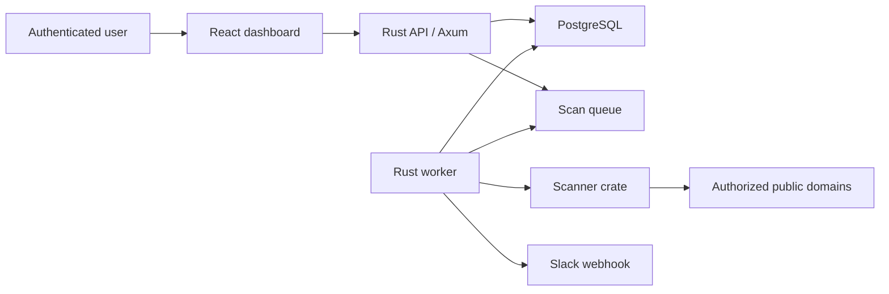

# CEEM Architecture

## System Shape

CEEM is a multi-tenant web application with a Rust API, Rust worker, PostgreSQL database, and React dashboard.

## Backend Crates

- `ceem-api`: HTTP API, auth boundary, organization-scoped routes.
- `ceem-worker`: background scan and alert execution.
- `ceem-scanner`: scanner guardrails and domain-only scan orchestration.
- `ceem-findings`: finding rules, severity, confidence, and lifecycle logic.
- `ceem-alerts`: Slack alert payloads and later delivery clients.
- `ceem-auth`: auth policy, password hashing, sessions, RBAC.
- `ceem-db`: database access and migrations integration.
- `ceem-shared`: shared models, validation, and cross-crate types.

## MVP Request Flow

1. User signs in.
2. User creates or selects organization.
3. User adds a domain and attests authorization.
4. API stores the asset and audit event.
5. User triggers scan.
6. API creates a scan job.
7. Worker claims job.
8. Scanner runs approved checks.
9. Worker stores raw scan results.
10. Findings engine creates or updates findings.
11. Alert engine queues Slack alerts for high/critical findings.
12. Dashboard shows asset, scan, finding, and remediation state.

## Scanner Policy

MVP scanner categories:

- DNS records: A, AAAA, CNAME, MX, TXT, NS.
- HTTP/HTTPS reachability.
- Redirect chain.
- TLS certificate metadata and expiration.
- Security headers.
- DMARC/SPF visibility through DNS TXT records.

Explicitly out of scope for MVP:

- Exploit checks.
- Credential testing.
- Authenticated third-party probing.
- CAPTCHAs or anti-automation bypass.
- Aggressive port scanning.
- IP-range scanning.

## Data Boundaries

Every tenant-owned table includes `organization_id` where applicable. API queries must scope by organization and role. The database schema intentionally favors explicit organization joins over implicit global access.

## Deployment Direction

Local:

- Docker Compose Postgres.
- API and worker run through Cargo.
- Frontend runs through Vite.

Cloud target:

- Containerized API.
- Containerized worker.
- Managed PostgreSQL.
- Secret manager for Slack webhooks and session keys.
- HTTPS ingress.
- CI builds and tests before deploy.

## Observability

Minimum:

- Structured JSON logs.
- Request tracing.
- Scan job state transitions.
- Alert delivery logs.
- Audit logs for user and organization actions.

Later:

- Metrics for scan latency, findings by severity, alert failure rate, and queue depth.

## Future CEEM Agent

The future `ceem-agent` extends CEEM into approved Linux host inventory. It should be a Rust binary packaged for RHEL first, running as a systemd service with enrollment, heartbeat, scoped jobs, and a local policy cache.

The control plane will add agent enrollment, agent identity, agent jobs, and agent events while preserving the same approval-first safety model used for external scans.

See [CEEM Agent and AI-Native Roadmap](ceem-agent-rhel-ai-native.md).
